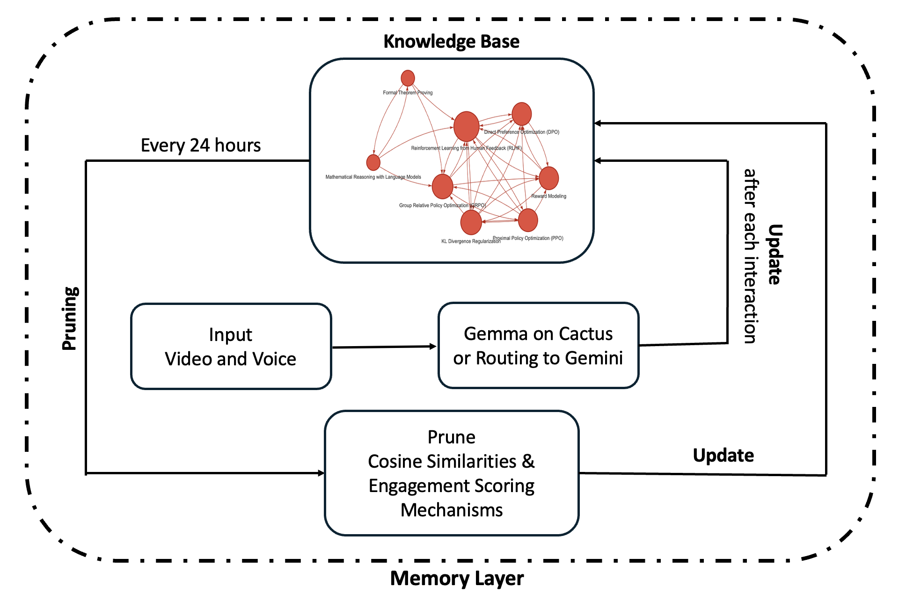
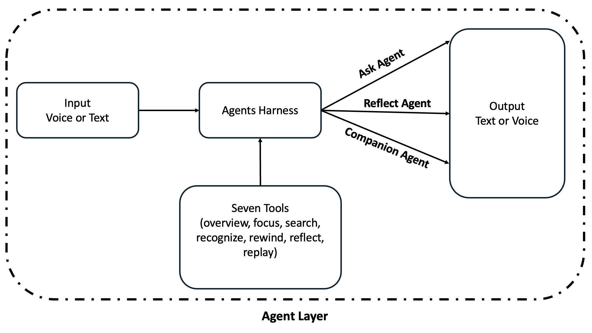
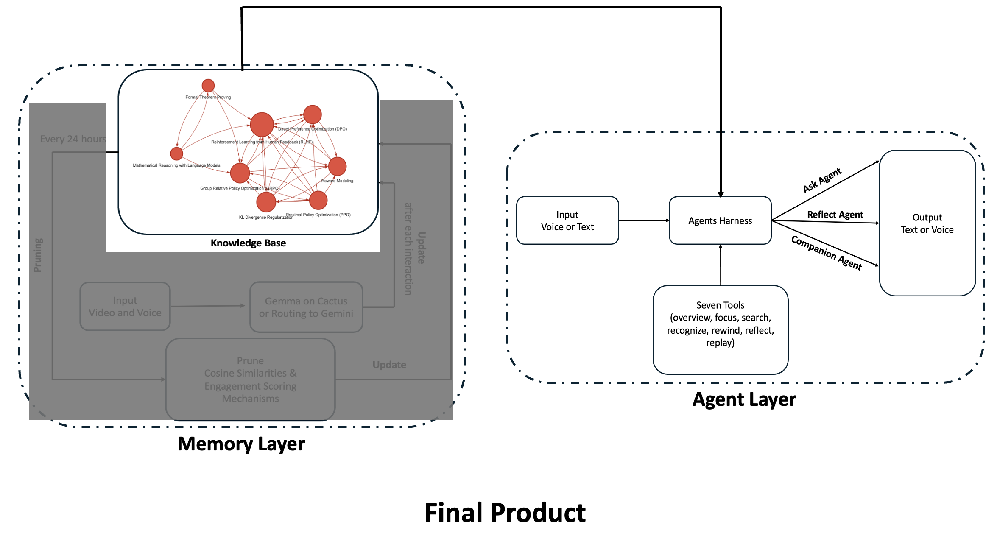

# Twin Mind: Your Digital Mind That Learns From Your Every Day Lives Interactions


We are building a digital twin of your mind that learns from your daily life.
It starts with your existing knowledge: markdown wikis or knowledge graph that captures what you already know as the starting state. Then, as you work, learn, and interact each day, your digital twin updates continuously.

New on-edge multi-modal advancements such as Gemma and Cactus make this possible. They can process video and voice in real time and capture what matters even in noisy, messy environments, whether you are coding, researching, or managing three kids.


## 🌟 The Problem

Generic LLMs don't know you. They require constant prompting, can't learn from your context, and can't distinguish signal from noise in your daily life. Most AI assistants are one-size-fits-all tools that forget you after each conversation.

## 💡 The Solution

**Twin Mind** is a digital twin of your mind that:
- **Starts with your existing knowledge**: Import markdown wikis or knowledge graphs
- **Learns continuously**: Captures and processes video, audio, and context from your daily life
- **Runs on-device**: Uses Gemma 4 on Cactus for real-time multimodal processing
- **Builds a living knowledge base**: Automatically extracts concepts and generates structured wiki articles
- **Pruning through Cosine Similarities and Engagement Scores**
- **Understands you**: Every interaction becomes more relevant, useful, and personal

Whether you're coding, researching, or managing three kids, Twin Mind captures what matters even in noisy, messy environments.

---

## 🏗️ Architecture








```
┌─────────────────────────────────────────────────────────────┐
│                        Twin Mind                             │
├─────────────────────────────────────────────────────────────┤
│                                                               │
│  Capture Layer (capture.py)                                  │
│  ├─ Live recording (webcam + mic)                            │
│  └─ Video file processing                                    │
│                                                               │
│  Analysis Layer (analyze.py)                                 │
│  ├─ Audio transcription (Gemma 4)                            │
│  ├─ Frame analysis (visual context)                          │
│  └─ Session summarization                                    │
│                                                               │
│  Learning Layer (learn.py)                                   │
│  ├─ Concept extraction                                       │
│  ├─ Wiki article generation or  knowledge graphs                                │
│  ├─ Vector embedding index                                   │
│  ├─ Engagement scoring                                       │
│  └─ File watcher (tracks user interaction)                   │
│                                                               │
│  Agent Layer (agent.py, agent_loop.py)                       │
│  ├─ Query interface (text/voice)                             │
│  ├─ Tool-calling system                                      │
│  └─ Reflection & insights                                    │
│                                                               │
│  Tools Layer (tools.py)                                  │
│  └─ 7 cognitive tools:                                       │
│     • overview  - Scan all knowledge                         │
│     • focus     - Deep dive into concepts                    │
│     • search    - Find keywords/ideas                        │
│     • recognize - Person/entity recall                       │
│     • rewind    - Time-based recall                          │
│     • reflect   - Pattern analysis                           │
│     • replay    - Session playback                           │
│                                                               │
└───────────────────────────────────────────────────────────────┘
           ↓
    Gemma 4 on Cactus (On-Device Processing)
```

---

## 🚀 Key Features

### 1. **On-Device Multimodal Processing**
- Real-time video and audio capture
- Powered by Gemma 4 on Cactus for privacy and speed
- Processes noisy, real-world environments

### 2. **Intelligent Knowledge Extraction**
- Automatic concept identification from sessions
- Generates structured markdown wiki articles
- Links related concepts automatically
- Tracks sources and timestamps

### 3. **Smart Retrieval & Engagement Scoring**
- Vector embeddings for semantic search
- Engagement-based ranking (recency + frequency of access)
- Cross-similarity filtering to reduce redundancy
- File watcher tracks real user interaction

### 4. **Conversational Agent Interface**
- Text or voice input/output
- Three agent modes:
  - **Ask**: Query your knowledge base
  - **Reflect**: Find patterns and gaps
  - **Companion**: Get insights after each session
- Tool-calling system for structured retrieval

### 5. **Living Knowledge Base**
- Auto-updated wiki index or knowledge graphs 
- Session summaries with timestamps
- Continuous learning from daily interactions
- Supports existing markdown/knowledge graphs as starting state


### 6. Hybrid Routing
- From our previous hackathon: https://github.com/sneha-cornell/warriors_function_gemma

---

## 📦 Installation

### Prerequisites
- Python 3.12+
- Gemma 4 weights (`gemma-4-e4b-it`)
- macOS (for TTS support) or Linux

### Setup

1. **Clone the repository**
   ```bash
   git clone <repository-url>
   cd yc-voice-agent-cactus-gemma
   ```

2. **Install Cactus and dependencies**
   ```bash
   cd cactus/python
   # Follow Cactus installation instructions
   ```

3. **Place Gemma 4 weights**
   ```bash
   mkdir -p cactus/weights
   # Download and place gemma-4-e4b-it weights
   ```

4. **Optional: Install audio support**
   ```bash
   pip install sounddevice  # For voice input
   pip install watchdog     # For file watching
   ```

---

## 🎯 Usage

### Capture & Learn

**Live recording (10 seconds default):**
```bash
cd cactus
python run.py
```

**Custom duration:**
```bash
python run.py --duration 30
```

**Process existing video:**
```bash
python run.py path/to/video.mp4
```

**What happens:**
1. Captures video frames + audio
2. Transcribes audio using Gemma 4
3. Analyzes visual context
4. Extracts key concepts
5. Generates wiki articles
6. Updates vector index
7. Saves session summary

### Query Your Knowledge

**Ask questions (text):**
```bash
python agent.py ask "What is GRPO?"
```

**Ask with voice input:**
```bash
python agent.py ask --voice
```

**Ask with voice output:**
```bash
python agent.py ask "What is reward modeling?" --speak
```

**Full voice interaction:**
```bash
python agent.py ask --voice --speak
```

### Reflect & Discover

**Find patterns across all knowledge:**
```bash
python agent.py reflect
```

**Reflect with voice:**
```bash
python agent.py reflect --voice --speak
```

### Get Session Insights

**Analyze latest session:**
```bash
python agent.py companion --voice --speak
```

**Analyze specific session:**
```bash
python agent.py companion --session 2026-04-18_223309
```

---

## 🧠 Cognitive Tools

Twin Mind provides 7 cognitive tools that mirror how human memory works:

| Tool | Description | Example |
|------|-------------|---------|
| `overview` | Scan all knowledge | "What do I know?" |
| `focus` | Deep dive into a concept | Read full article on "reward-modeling.md" |
| `search` | Find keywords/ideas | Search for "transformer architecture" |
| `recognize` | Recall person/entity | "Who is John Smith?" |
| `rewind` | Time-based recall | "What happened on 2026-04-15?" |
| `reflect` | Pattern analysis | Find patterns about "machine learning" |
| `replay` | Session playback | "What did I see in the latest session?" |

---

## 📊 Engagement Scoring

Twin Mind ranks knowledge by **engagement score**, not just semantic similarity:

```python
engagement_score = Σ exp(-0.1 × days_since_access)
```

**Why this matters:**
- Recently accessed files rank higher
- Frequently accessed files rank higher
- Combines real user behavior with semantic relevance
- File watcher tracks opens/edits automatically

**Filtering:**
- High cross-similarity + low engagement = dropped (redundant, unused)
- Keeps knowledge base focused on what you actually use

---

## 📁 Project Structure

```
yc-voice-agent-cactus-gemma/
├── cactus/                      # Main Twin Mind implementation
│   ├── run.py                   # Capture & learn pipeline
│   ├── agent.py                 # Query interface
│   ├── agent_loop.py            # Tool-calling loop
│   ├── capture.py               # Video/audio capture
│   ├── analyze.py               # Transcription & analysis
│   ├── learn.py                 # Knowledge extraction & indexing
│   ├── tools.py                 # 7 cognitive tools
│   ├── data/                    # Wiki articles & index
│   │   ├── index.md             # Knowledge base index
│   │   ├── *.md                 # Wiki articles
│   │   └── vector_index/        # Embeddings & logs
│   ├── sessions/                # Session recordings & summaries
│   │   └── YYYY-MM-DD_HHMMSS/   # Timestamped sessions
│   └── python/                  # Cactus Python bindings
└── knowledge graphs/            # Knowledge graph experiments
    └── twin-mind/               # Alternative KG implementations
```

---

## 🔬 Technical Details

### Embedding Pipeline
- One embedding per markdown section (chunked on `## headers`)
- Stored in `cactus_index` with filename metadata
- Incremental indexing (cached in `indexed.json`)

### Retrieval Strategy
1. **Semantic threshold**: Filter candidates by cosine similarity
2. **Engagement ranking**: Rank by time-decayed access frequency
3. **Diversity filter**: Drop highly redundant articles
4. **Access logging**: Track retrieved files for future scoring

### File Watcher
- **Read detection**: Polls `st_atime` every 5 seconds
- **Write detection**: FSEvents via `watchdog` (instant)
- **Access log**: `vector_index/access_log.json`
- Works across editors (VS Code, Obsidian, etc.)

---

## 🛠️ Knowledge Graph Integration

The `knowledge graphs/twin-mind/` directory contains experimental implementations for building knowledge graphs from markdown:

- **LlamaIndex + Gemini**: Fast knowledge graph construction
- **Neo4j integration**: Graph database backend
- **HTML visualization**: Interactive graph exploration

See `knowledge graphs/twin-mind/README_LLAMAINDEX_GEMINI_FAST_KG.md` for details.

---

## 🔮 Future Directions

- [ ] Real-time streaming (continuous capture)
- [ ] Multi-modal memory (images, documents, code)
- [ ] Proactive insights (notifications based on patterns)
- [ ] Export to Obsidian, Roam, Notion
- [ ] Mobile app (iOS/Android)
- [ ] Collaborative knowledge bases (team/family mode)
- [ ] Fine-tuning on personal data

---

## 🤝 Contributing

This project is in active development. Contributions welcome!

1. Fork the repository
2. Create a feature branch
3. Make your changes
4. Submit a pull request

---

## 📄 License

[Add your license here]

---

## 🙏 Acknowledgments

- **Gemma 4** by Google DeepMind
- **Cactus** for on-device inference
- Built for YC Hackathon 2026

---

## 📧 Contact

[Add your contact information here]

---

**Twin Mind**: Because your AI should know you as well as you know yourself.
